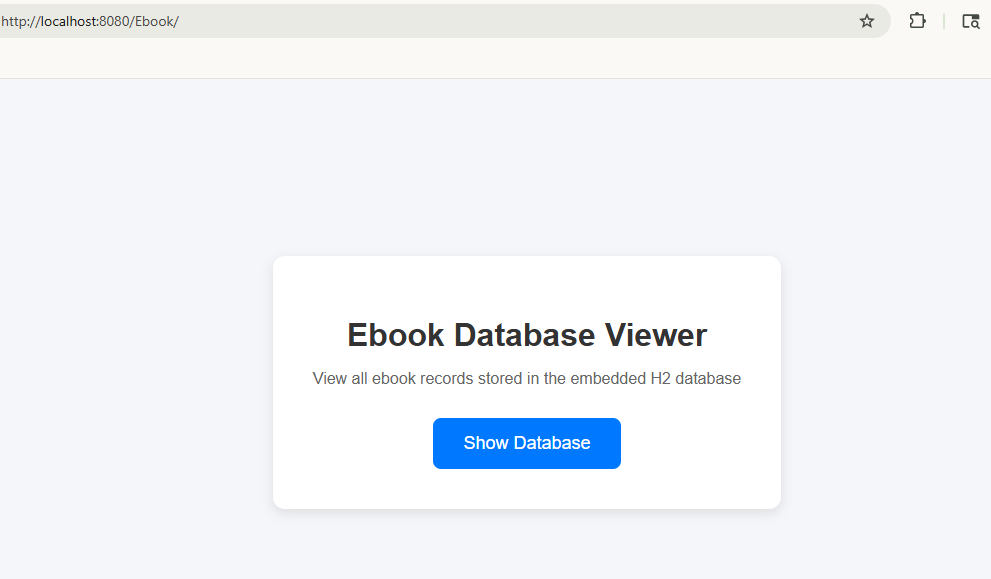
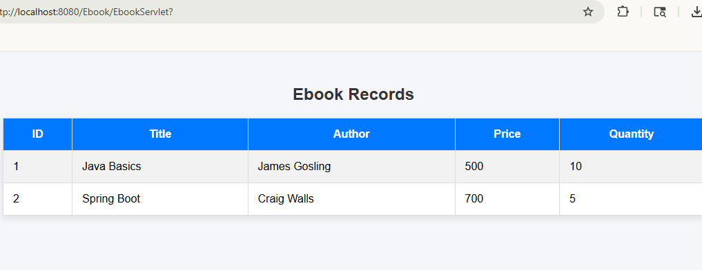

# 📚 Ebook Database Viewer (Java Servlet + JDBC + H2 Database)


A simple Java Servlet-based web application that demonstrates database connectivity using **pure JDBC** with an embedded **H2 Database**.

The application retrieves ebook records from the database and dynamically displays them in a styled HTML table using Java Servlets.

---

## ✨ Features

- Java Servlet based web application
- JDBC database connectivity
- Dynamic HTML table generation
- Embedded H2 database integration
- Apache Tomcat deployment
- Styled frontend using HTML & CSS
- Legacy MySQL JDBC implementation preserved for reference
- No external database installation required

---

## 🚀 Tech Stack

- Java 8
- Java Servlets
- JDBC
- H2 Database
- Apache Tomcat 9
- HTML5
- CSS3
- Eclipse / Spring Tool Suite (STS)

---

## 🗂️ Project Structure

```text
Experiment
├── connector
│   ├── mysql-connector.jar
│   └── protobuf-java.jar
│
└── Ebook
    ├── src
    │   └── com/demo
    │       ├── EbookServlet.java
    │       └── DemoMySQLReference.java
    │
    ├── WebContent
    │   ├── index.html
    │   └── WEB-INF
    │       ├── web.xml
    │       └── lib
    │           └── h2.jar
```

---

## ⚙️ Database Information

### Current Implementation

This project currently uses an embedded **H2 Database** for easier execution and portability.

Database setup and sample data creation are handled directly inside the servlet using JDBC.

---

### Original Implementation

The original version of this project was developed using:

* MySQL
* MySQL Connector/J
* JDBC

The original implementation has been preserved in:

```text
DemoMySQLReference.java
```

This was done to preserve the original college experiment while improving portability and ease of execution.

---

## ▶️ Running the Application

### Prerequisites

- Java 8 or above
- Apache Tomcat 9
- Eclipse / STS

---

### Steps

#### 1. Import Project

```text
File → Import → Existing Projects into Workspace
```

---

#### 2. Configure Tomcat

Add Apache Tomcat 9 server in Eclipse / STS.

---

#### 3. Add Project to Server

```text
Right Click Server → Add and Remove
```

Add the `Ebook` project.

---

#### 4. Run Project

```text
Right Click Project → Run As → Run on Server
```

---

#### 5. Open in Browser

```text
http://localhost:8080/Ebook/
```

Click the **Show Database** button to display ebook records.

---

## 📄 Database Schema

```sql
CREATE TABLE ebook (
    id INT PRIMARY KEY,
    title VARCHAR(100),
    author VARCHAR(100),
    price INT,
    quantity INT
);
```

---

## 📸 Output

The application displays ebook records in a styled HTML table containing:

* ID
* Book Title
* Author
* Price
* Quantity

### Home Page


### Database Table


---

## 📖 Learning Objectives

This project demonstrates:

* Servlet lifecycle and request handling
* JDBC database operations
* Dynamic HTML generation using Java
* Database connectivity in Java web applications
* Working with embedded databases
* Deploying Java web applications on Apache Tomcat

---

## 📌 Note

This project is intentionally implemented using **pure JDBC instead of ORM frameworks like Hibernate/JPA** to demonstrate strong database connectivity and SQL fundamentals.